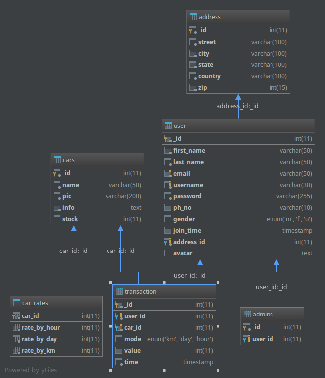
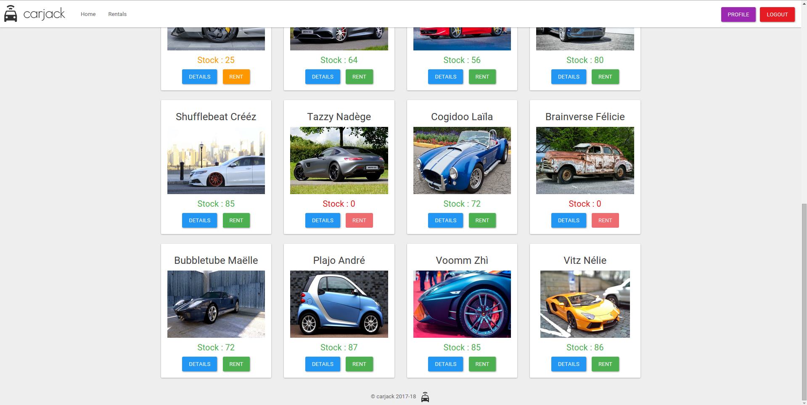
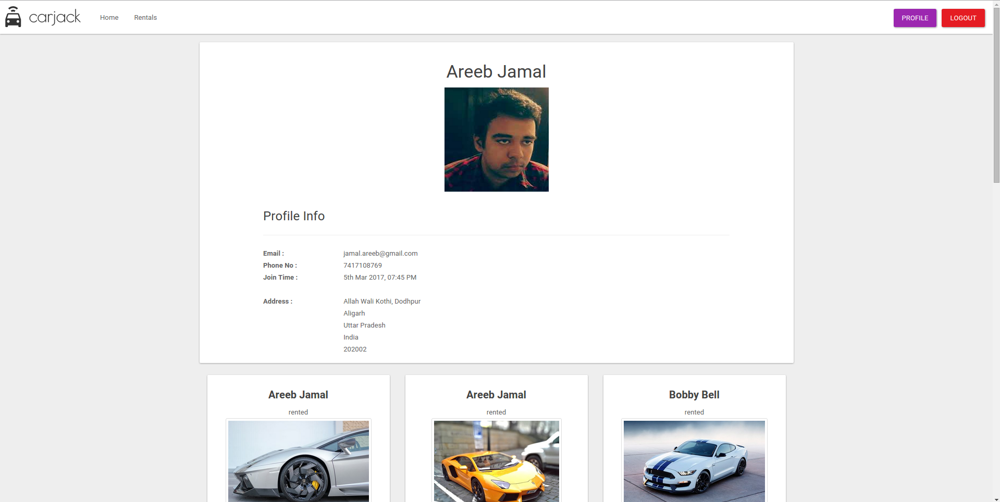
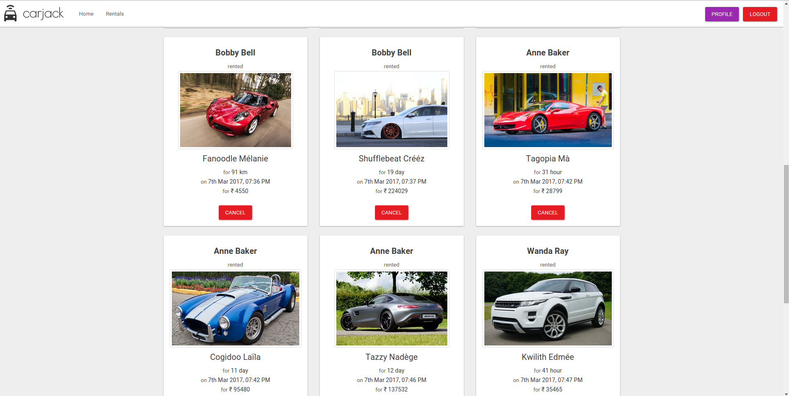
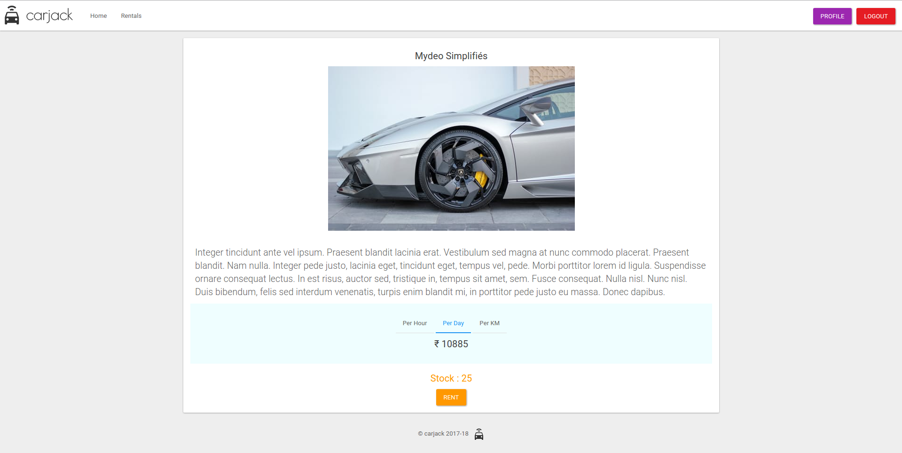
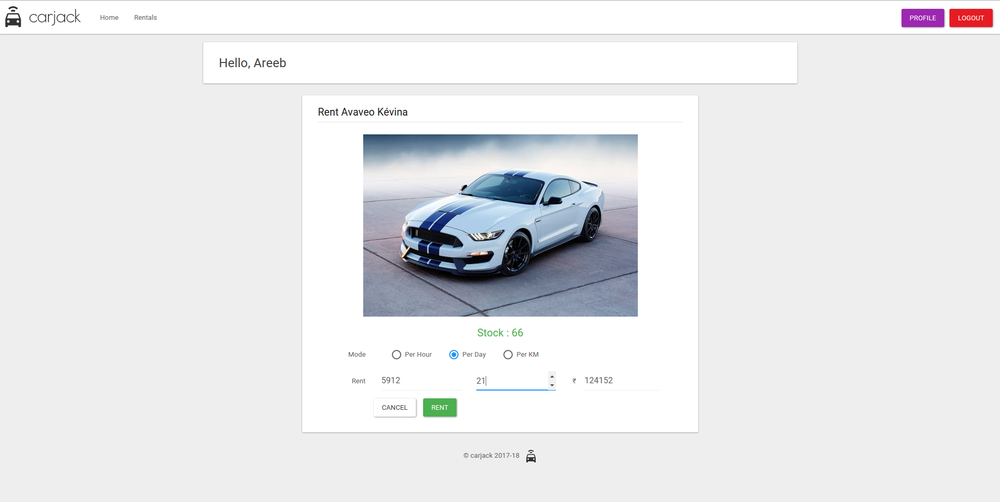

## Car Rental System : carjack

  
> Car Rental Project in PHP

### carjack
Carjack is a simple car rental web app made using PHP and MySQL following MVP and Object Oriented design pattern!

**NOTE** - *The code is not suited for production and was developed as a personal and college assignment in a week* 

### ER Diagram

The relational database should be configured this way

### SQL

DDL and initial configuration is present in [migrate_00.sql](migrate_00.sql) and [migrate_01.sql](migrate_01.sql) respectively

Admin Login and Password : `admin` - `password`

### Screenshots

### Author
[@iamareebjamal](https://github.com/iamareebjamal)